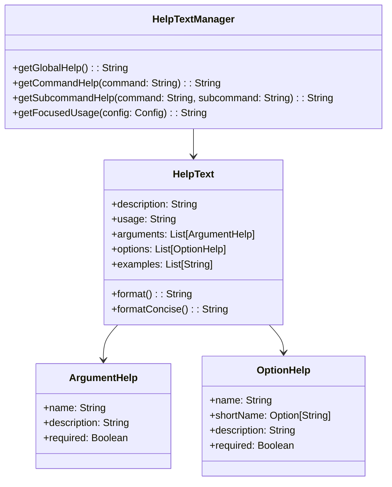

# Enhanced CLI Help and Usage Experience Design for Overlord

This document outlines the design for an enhanced CLI help and usage experience in the Overlord project.

## Current State Analysis

The current CLI implementation:
- Uses scopt for command parsing and help/usage output
- Has a hierarchical command structure (e.g., `create project`, `update catalog`)
- Shows comprehensive auto-generated help for empty input or explicit help flags
- Has a help command that prints the global usage text
- Displays error messages for missing required arguments

The main limitations of the current approach:
1. The default help output is verbose and shows all commands and options
2. There's no focused help for specific commands or subcommands
3. The help command doesn't provide detailed information about specific commands
4. Usage examples are missing from the help text

## Enhanced Help and Usage Design

### 1. Streamlined Default Usage Output

When a user runs the CLI with no arguments or with `--help`/`-h`, we'll display a concise overview:

```
USAGE:
  overlord <command> [subcommand] [options]

COMMANDS:
  create     Create a new project or from a template
  generate   Generate various outputs (tests, reports, SVD files)
  clean      Clean generated files
  update     Update projects or catalog
  template   Manage project templates
  help       Display help for a specific command

Run 'overlord help <command>' for more information on a specific command.
```

This provides a quick overview without overwhelming the user with details.

### 2. Focused Command/Subcommand Usage

When a user runs a command without required subcommands or arguments, we'll show focused help for that command:

```
USAGE:
  overlord create <subcommand> [options]

SUBCOMMANDS:
  project         Create a new project from a .yaml file
  from-template   Create a new project from a template

Run 'overlord help create' for more detailed information.
```

Similarly, for subcommands with missing required arguments:

```
USAGE:
  overlord create project <infile> --board <board-name>

ARGUMENTS:
  <infile>        Filename should be a .yaml file to use for the project

OPTIONS:
  --board <name>  Board definition to use

Run 'overlord help create project' for more detailed information.
```

### 3. Explicit Help Command

We'll implement a dedicated `help` command that provides detailed information about commands and subcommands:

```
overlord help <command> [subcommand]
```

For example:

```
$ overlord help create
Command: create

DESCRIPTION:
  Create a new project or from a template. This command allows you to create
  projects either from scratch using a YAML configuration file or from
  predefined templates.

USAGE:
  overlord create <subcommand> [options]

SUBCOMMANDS:
  project         Create a new project from a .yaml file
  from-template   Create a new project from a template

EXAMPLES:
  overlord create project my-project.yaml --board arty-a7
  overlord create from-template bare-metal my-new-project
```

And for a specific subcommand:

```
$ overlord help create from-template
Command: create from-template

DESCRIPTION:
  Create a new project from a template. This command creates a new project
  directory with files based on the selected template, customized with your
  project name.

USAGE:
  overlord create from-template <template-name> <project-name> [options]

ARGUMENTS:
  <template-name>   Name of the template to use (e.g., bare-metal, linux-app)
  <project-name>    Name of the project to create

OPTIONS:
  -y, --yes         Automatically agree to download resources if needed

EXAMPLES:
  overlord create from-template bare-metal my-project
  overlord create from-template linux-app my-linux-app --yes
```

## Implementation Strategy

To implement this enhanced help and usage experience, we'll need to:

1. **Create a HelpTextManager**: This will be responsible for generating and managing help text for different commands and subcommands.

2. **Extend the CommandLineParser**: Modify the parser to support the new help command and focused usage output.

3. **Implement Custom Help Formatters**: Create custom formatters to generate concise and detailed help text.

4. **Add Usage Examples**: Add examples to the help text for each command and subcommand.

### HelpTextManager Design



### Integration with scopt

While scopt provides built-in help generation, we'll need to customize it to meet our requirements:

1. **Override Default Help Generation**: Intercept the default help generation and replace it with our streamlined version.

2. **Custom Help Command**: Implement a dedicated help command that uses our HelpTextManager.

3. **Focused Usage for Errors**: When scopt reports errors (like missing arguments), we'll show focused usage for the relevant command.

```scala
// Custom help command
val helpCommand = cmd("help")
  .action((_, c) => c.copy(command = Some("help")))
  .text("Display help for a specific command")
  .children(
    arg[String]("<command>")
      .optional()
      .action((x, c) => c.copy(options = c.options + ("help-command" -> x)))
      .text("Command to get help for"),
    arg[String]("<subcommand>")
      .optional()
      .action((x, c) => c.copy(options = c.options + ("help-subcommand" -> x)))
      .text("Subcommand to get help for")
  )

// Add to the OParser sequence
OParser.sequence(
  programName("overlord"),
  head("overlord", "1.0"),
  createCommand,
  generateCommand,
  cleanCommand,
  updateCommand,
  templateCommand,
  helpCommand,
  // Custom help rendering
  help("help").text("prints this usage text").hidden()
)
```

### CommandExecutor Modifications

We'll need to modify the CommandExecutor to handle the help command and provide focused usage:

```scala
def execute(config: Config): Boolean = {
  (config.command, config.subCommand) match {
    case (Some("help"), _) =>
      executeHelpCommand(config)
      
    // Other commands...
    
    case _ =>
      // Show focused usage for unknown command
      println(HelpTextManager.getFocusedUsage(config))
      false
  }
}

private def executeHelpCommand(config: Config): Boolean = {
  val commandOpt = config.options.get("help-command").map(_.toString)
  val subcommandOpt = config.options.get("help-subcommand").map(_.toString)
  
  (commandOpt, subcommandOpt) match {
    case (None, _) =>
      // Show global help
      println(HelpTextManager.getGlobalHelp())
      
    case (Some(command), None) =>
      // Show help for specific command
      println(HelpTextManager.getCommandHelp(command))
      
    case (Some(command), Some(subcommand)) =>
      // Show help for specific subcommand
      println(HelpTextManager.getSubcommandHelp(command, subcommand))
  }
  
  true
}
```

### Handling Missing Arguments

When a command is invoked with missing required arguments, we'll show focused usage:

```scala
// In CommandLineParser.parse
OParser.parse(parser, args, initialConfig) match {
  case Some(config) =>
    // Successfully parsed
    Some(config)
    
  case None =>
    // Parse failed - show focused usage if possible
    val partialConfig = parsePartial(parser, args, initialConfig)
    println(HelpTextManager.getFocusedUsage(partialConfig))
    None
}
```

## Help Content Structure

For each command and subcommand, we'll define:

1. **Description**: A detailed explanation of what the command does
2. **Usage**: The command syntax
3. **Arguments**: Required and optional positional arguments
4. **Options**: Flags and options with their descriptions
5. **Examples**: Practical usage examples

This information will be stored in a structured format that can be rendered in different ways (concise or detailed).

## Example Help Content

Here's an example of the help content structure for the `create from-template` command:

```scala
val createFromTemplateHelp = HelpText(
  description = """
    |Create a new project from a template. This command creates a new project
    |directory with files based on the selected template, customized with your
    |project name.
    """.stripMargin,
  
  usage = "overlord create from-template <template-name> <project-name> [options]",
  
  arguments = List(
    ArgumentHelp(
      name = "template-name",
      description = "Name of the template to use (e.g., bare-metal, linux-app)",
      required = true
    ),
    ArgumentHelp(
      name = "project-name",
      description = "Name of the project to create",
      required = true
    )
  ),
  
  options = List(
    OptionHelp(
      name = "yes",
      shortName = Some("y"),
      description = "Automatically agree to download resources if needed",
      required = false
    )
  ),
  
  examples = List(
    "overlord create from-template bare-metal my-project",
    "overlord create from-template linux-app my-linux-app --yes"
  )
)
```

## Conclusion

This design provides a comprehensive plan for enhancing the CLI help and usage experience in the Overlord project. By implementing:

1. A streamlined default usage output
2. Focused command/subcommand usage hints
3. An explicit help command with detailed information

We'll significantly improve the usability of the CLI while maintaining compatibility with the existing command structure. The design leverages scopt's capabilities while extending them to provide a more user-friendly experience.

The implementation will require creating a new HelpTextManager component, extending the CommandLineParser, and modifying the CommandExecutor to handle the help command and provide focused usage information.