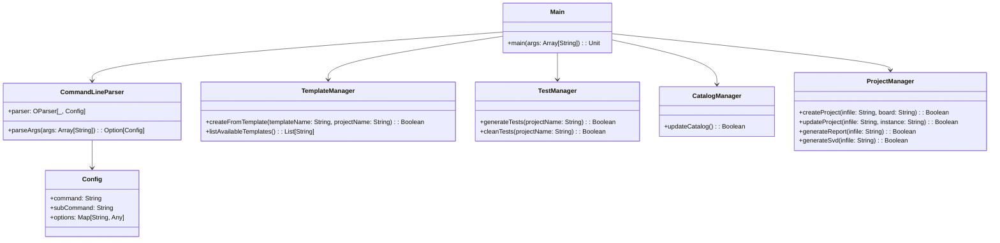

# Detailed Plan for Implementing a Modern CLI Interface for Overlord

## Overview

Based on our analysis of the current Overlord CLI and your requirements, we'll implement a modern command-line interface with a hierarchical command structure similar to git. This new CLI will support template-based workflows, test generation and cleanup, and catalog updates.

## Current State Analysis

The current CLI uses the scopt library and has a relatively flat command structure with commands like:
- `create` - Generate a compile project
- `update` - Update an existing project instance
- `report` - Print information about the overall structure
- `svd` - Produce a CMSIS-SVD file

These commands have various options like `--board`, `--out`, `--resources`, etc.

## Target State

We'll implement a modern CLI with a hierarchical command structure:

```
overlord create from-template <template-name> <project-name>
overlord generate test <project-name>
overlord clean test <project-name>
overlord update catalog
```

And we'll maintain existing functionality through commands like:

```
overlord create project <infile> --board <board-name>
overlord update project <infile> --instance <instance-name>
overlord generate report <infile>
overlord generate svd <infile>
```

## Implementation Plan

### 1. Command Structure Design

We'll design a hierarchical command structure with the following top-level commands:


### 2. CLI Library Selection

We'll continue using the scopt library since it's already in use and supports nested commands. However, we'll restructure how we define and use the commands to create a more hierarchical structure.

### 3. Implementation Steps

#### 3.1. Refactor Main.scala

1. Create a new command structure using scopt's builder pattern
2. Implement nested commands with proper hierarchy
3. Update the command handling logic in the `main` method

#### 3.2. Implement Template-Based Workflow

1. Create a `TemplateManager` class to handle template operations
2. Implement the `create from-template` command
3. Add support for different template types (bare-metal, linux-app, etc.)

#### 3.3. Implement Test Generation and Cleanup

1. Create a `TestManager` class to handle test-related operations
2. Implement the `generate test` command
3. Implement the `clean test` command

#### 3.4. Implement Catalog Updates

1. Create a `CatalogManager` class to handle catalog operations
2. Implement the `update catalog` command

#### 3.5. Maintain Existing Functionality

1. Map existing commands to the new structure
2. Ensure backward compatibility where possible

### 4. Code Structure



### 5. Implementation Details

#### 5.1. Command Line Parser

We'll create a more modular command line parser that supports nested commands:

```scala
val parser: OParser[_, Config] = {
  val builder = OParser.builder[Config]
  import builder._

  val createCommand = cmd("create")
    .action((_, c) => c.copy(command = "create"))
    .text("Create a new project or from a template")
    .children(
      cmd("project")
        .action((_, c) => c.copy(subCommand = "project"))
        .text("Create a new project from an .over file")
        .children(
          arg[String]("<infile>")
            .required()
            .action((x, c) => c.copy(options = c.options + ("infile" -> x)))
            .text("filename should be a .yaml file to use for the project"),
          opt[String]("board")
            .required()
            .action((x, c) => c.copy(options = c.options + ("board" -> x)))
            .text("board definition to use")
        ),
      cmd("from-template")
        .action((_, c) => c.copy(subCommand = "from-template"))
        .text("Create a new project from a template")
        .children(
          arg[String]("<template-name>")
            .required()
            .action((x, c) => c.copy(options = c.options + ("template-name" -> x)))
            .text("name of the template to use"),
          arg[String]("<project-name>")
            .required()
            .action((x, c) => c.copy(options = c.options + ("project-name" -> x)))
            .text("name of the project to create")
        )
    )

  // Similar definitions for other commands...

  OParser.sequence(
    programName("overlord"),
    head("overlord", "1.0"),
    createCommand,
    generateCommand,
    cleanCommand,
    updateCommand
  )
}
```

#### 5.2. Command Execution

We'll implement a command execution system that routes commands to the appropriate handlers:

```scala
def executeCommand(config: Config): Unit = {
  (config.command, config.subCommand) match {
    case ("create", "project") =>
      val infile = config.options("infile").asInstanceOf[String]
      val board = config.options("board").asInstanceOf[String]
      ProjectManager.createProject(infile, board)

    case ("create", "from-template") =>
      val templateName = config.options("template-name").asInstanceOf[String]
      val projectName = config.options("project-name").asInstanceOf[String]
      TemplateManager.createFromTemplate(templateName, projectName)

    // Other command handlers...

    case _ =>
      error("Unknown command combination")
      sys.exit(1)
  }
}
```

#### 5.3. Template Manager

The TemplateManager will handle template-based operations:

```scala
object TemplateManager {
  def createFromTemplate(templateName: String, projectName: String): Boolean = {
    info(s"Creating project '$projectName' from template '$templateName'")

    // Implementation details for creating from template
    // This would involve:
    // 1. Locating the template
    // 2. Copying template files to the new project directory
    // 3. Customizing files with the project name

    true
  }

  def listAvailableTemplates(): List[String] = {
    // Implementation to list available templates
    List("bare-metal", "linux-app")
  }
}
```

#### 5.4. Test Manager

The TestManager will handle test generation and cleanup:

```scala
object TestManager {
  def generateTests(projectName: String): Boolean = {
    info(s"Generating tests for project '$projectName'")

    // Implementation details for generating tests
    // This would involve:
    // 1. Analyzing the project structure
    // 2. Creating appropriate test files

    true
  }

  def cleanTests(projectName: String): Boolean = {
    info(s"Cleaning tests for project '$projectName'")

    // Implementation details for cleaning tests
    // This would involve:
    // 1. Identifying test artifacts
    // 2. Removing them

    true
  }
}
```

#### 5.5. Catalog Manager

The CatalogManager will handle catalog updates:

```scala
object CatalogManager {
  def updateCatalog(): Boolean = {
    info("Updating catalog from remote repository")

    // Implementation details for updating the catalog
    // This would involve:
    // 1. Connecting to the remote repository
    // 2. Downloading the latest definitions
    // 3. Updating the local catalog

    true
  }
}
```

### 6. Migration Strategy

1. Create the new command structure alongside the existing one
2. Implement the new functionality (templates, tests, catalog updates)
3. Map existing functionality to the new command structure
4. Gradually phase out the old command structure

## Timeline and Milestones

1. **Week 1**: Design and implement the new command structure
2. **Week 2**: Implement template-based workflow
3. **Week 3**: Implement test generation and cleanup
4. **Week 4**: Implement catalog updates and finalize integration

## Conclusion

This plan outlines a comprehensive approach to modernizing the Overlord CLI interface. By implementing a hierarchical command structure and adding support for template-based workflows, test generation/cleanup, and catalog updates, we'll create a more user-friendly and powerful CLI that follows modern best practices.