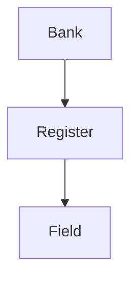

# Hardware Register Description YAML Format Specification

## File Structure


### Bank-Level Structure (Root Element)
- **bank** (array of objects): Contains register bank definitions
  - **address** (hex string): Base address (e.g., "0xa0020000")
  - **name** (string): Bank identifier (e.g., "VCU_PL_DECODE")
  - **description** (string): Functional overview
  - **register** (array): List of registers in bank

### Register Object
| Field | Required | Format | Description |
|-------|----------|--------|-------------|
| default | Yes | Hex string | Power-on value (e.g., "0x00000000") |
| description | Yes | String | Functional purpose |
| field | Yes | Array | Bitfield definitions |
| name | Yes | String | Register name (e.g., "MCU_RESET") |
| offset | Yes | Hex string | Address offset from bank base |
| type | Yes | Enum | Access: mixed/rw/ro/wo |
| width | Yes | Numeric string | Bit width (typically "32") |

### Field Object
| Field | Required | Format | Constraints |
|-------|----------|--------|-------------|
| bits | Yes | String | Bit range "high:low" |
| name | Yes | String | Field identifier |
| type | Yes | Enum | Access: raz/rw/ro/wo |
| shortdesc | No | String | Brief functional description |
| longdesc | No | String | Detailed technical documentation |

## Data Type Requirements
1. **Hex Values**: Must use "0x" prefix (e.g., "0x1A3F")
2. **Bit Ranges**: 
   - Single bit: "0"
   - Multi-bit: "31:16"
3. **Access Types**:
   - raz: Read-as-zero
   - rw: Read-write
   - ro: Read-only
   - wo: Write-only
   - mixed: Combination of access types

## Validation Rules
1. **Offset Alignment**: Must be multiple of (width/8)
   - 32-bit: 4-byte aligned offsets
2. **Bit Coverage**: Combined field ranges must exactly cover 0-(width-1)
3. **Name Uniqueness**:
   - Register names unique within bank
   - Field names unique within register
4. **Access Compatibility**:
   - Field types must be subset of register type
   - wo field cannot exist in ro register

## Example Template
```yaml
bank:
- address: "0xA0000000"
  name: "SOC_CTRL"
  description: "System control registers"
  register:
  - default: "0x00000000"
    description: "Clock control"
    field:
    - bits: "31:24"
      name: "clkDiv"
      type: rw
      shortdesc: "Clock divider ratio"
    - bits: "23:1"
      name: "RESERVED"
      type: raz
    - bits: "0"
      name: "clkEn"
      type: rw
    name: "CLK_CTRL"
    offset: "0x00000100"
    type: rw
    width: "32"
```

## Implementation Notes
1. **Version Control**: Add metadata section
2. **Tool Integration**:
```python
def validate_width(register):
    total_bits = sum(
        int(hi)-int(lo)+1 
        for f in register["field"] 
        for hi,lo in [f["bits"].split(":")]
    )
    assert total_bits == int(register["width"])